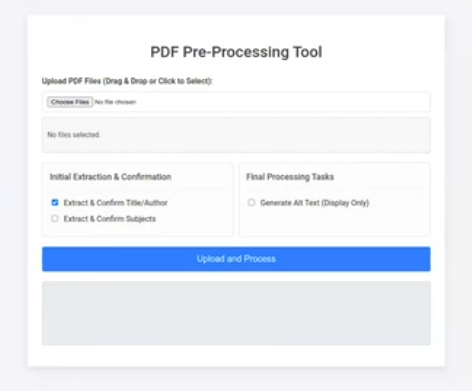

# AI PDF Processing WebApp

* Demo video (Vimeo):<p>
[](https://vimeo.com/1130958514)

This project is a Flask-based web application designed to process and enhance PDF documents using AI. It provides a web interface (served via `app.py`) where users can upload PDF files. The backend then uses a local Ollama instance to perform several enhancement tasks:

* **Title & Author Extraction:** Analyzes the first page (text and image) to suggest a title and author, especially when metadata is missing or generic.
* **Metadata Embedding:** Writes the corrected title, author, and subject keywords directly into the PDF's metadata.
* **Alt Text Generation:** Optionally scans the PDF for significant images and uses a vision-capable AI model to generate descriptive alt text for accessibility.


The application uses Flask-SocketIO and gevent for real-time progress updates to the user in the browser.

## Installation

There are two primary methods to set up the application environment. The Nix-based approach is recommended as it ensures all system and Python dependencies are correct.

### Method 1: Nix (Recommended)

This project uses [Nix Flakes](https://nixos.wiki/wiki/Flakes) to create a reproducible development environment that includes all necessary Python packages and system-level libraries (like `qpdf` and `libglvnd`).

1.  **Install Nix:** Ensure you have Nix installed on your system with Flakes support enabled.
2.  **Enter Environment:** From the project's root directory, run:
    ```bash
    nix develop
    ```
    This command downloads all dependencies defined in `flake.nix` and drops you into a shell where they are all available.

### Method 2: Python Virtual Environment (Manual)

If you are not using Nix, you can set up a local Python virtual environment.

1.  **Install System Dependencies:** This application relies on non-Python libraries. You must install them manually using your system's package manager.
    * `qpdf`
    * `libglvnd` (or equivalent, for PyMuPDF)

    For example, on Ubuntu/Debian:
    ```bash
    sudo apt-get update
    sudo apt-get install qpdf libglvnd0
    ```

2.  **Create Virtual Environment:**
    ```bash
    python3 -m venv venv
    source venv/bin/activate
    ```

3.  **Install Python Packages:** The `flake.nix` file contains the most complete list of dependencies. Install them using pip:
    ```bash
    pip install flask flask-cors flask-socketio gevent gevent-websocket pikepdf pymupdf requests
    ```
    *(Note: The provided `requirements.txt` is minimal and missing key packages like `flask-socketio`.)*

### Configuration: Ollama

This application **requires** a running [Ollama](https://ollama.com/) instance.

1.  **Install and Run Ollama:** Follow the official instructions to install Ollama on your machine.
2.  **Pull Models:** The application is configured to use `llama3.2` (text) and `llama3.2-vision` (vision). You must pull these models:
    ```bash
    ollama pull llama3.2
    ollama pull llama3.2-vision
    ```
3.  **Ensure Ollama is Running:** The app expects Ollama to be running and accessible at `http://127.0.0.1:11434`.

## Usage

Follow these steps to run the application, as you described:

1.  **Terminal 1: Start the Flask App**
    * First, enter your development environment (either `nix develop` or `source venv/bin/activate`).
    * Then, run the main application:
        ```bash
        python app.py
        ```
    * The server will start on `http://127.0.0.1:5000`.

2.  **Terminal 2: Expose with Ngrok (Optional)**
    * To access the application from another device or to have a public-facing URL, use [ngrok](https://ngrok.com/).
    * Run the following command to create a secure tunnel to your local port 5000:
        ```bash
        ngrok http 5000
        ```

3.  **Access in Browser**
    * **If using ngrok:** Open the "Forwarding" URL provided by ngrok in your browser (e.g., `https://xxxx-xxxx-xxxx.ngrok-free.app`).
    * **If not using ngrok:** Open `http://localhost:5000` in your browser.

You can now use the web interface to upload and process your PDF files.
<p>
<p>
<p>
    
## strip_and_clean.py — brief description

This script is run on all PDF's after processing with the app.  This way, exiftool and pdfinfo will read the correct and sole metadata for author, title, and keywords.
- Opens a PDF (or a folder of PDFs) and **cleans document metadata**.

- **Reads** existing `/Title`, `/Author`, and `/Keywords` (skips `/Subject`).

- **Removes** embedded XMP and **clears** all Info dictionary keys.

- **Writes back only**: Title, Author, and Keywords (leaves `/Creator` empty).

- **Rebuilds XMP** with:
  - `dc:title` (x-default)
  - `dc:creator` (sequence with the single author)
  - `pdf:Keywords`
  - fresh UTC `xmp:CreateDate` and `xmp:ModifyDate`

- Saves **in place** (`--inplace`) or to an **output directory**; supports directory inputs via `--glob` and quieter logs with `--quiet`.

Usage
-----

```bash
# Clean one file in place
python3 strip_and_clean.py file.pdf --inplace

# Clean all PDFs in a folder into ./out/
python3 strip_and_clean.py /path/to/folder ./out --glob "*.pdf"
```
